# Instalasi

## Instalasi .NET Core SDK

* Buka halaman unduh dotnet SDK di [sini](https://dotnet.microsoft.com/download)
* Setelah muncul tampilan seperti berikut, scroll ke bawah

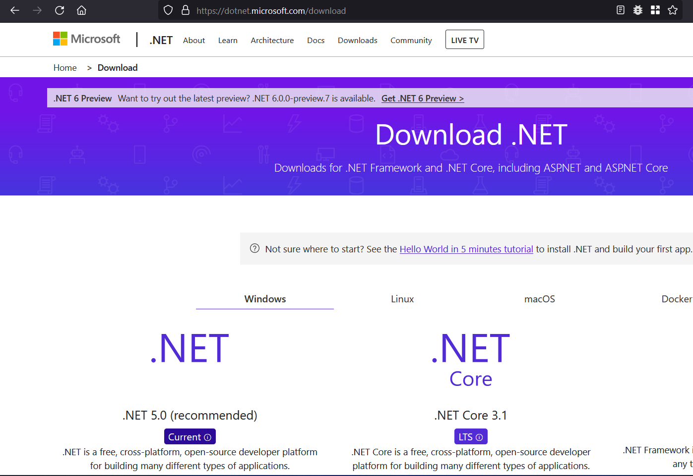

* Pada bagian '.NET 5.0' (versi saat dokumen ini dibuat, jika ada versi 
  terbaru silakan pilih versi tersebut) tekan tombol 'Download .NET SDK x64'

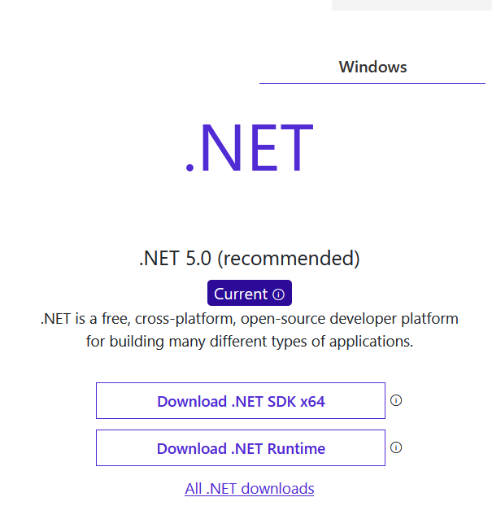

* Saat muncul tampilan seperti berikut, tekan 'Install'

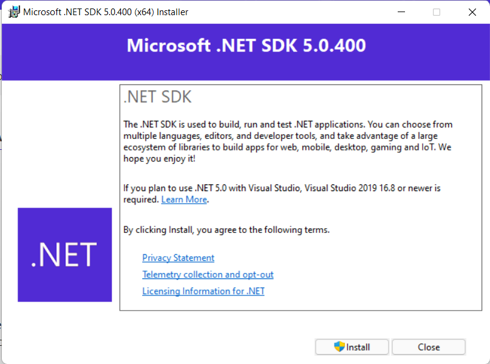

* Setelah proses instalasi selesai, akan keluar tampilan berikut, tekan close

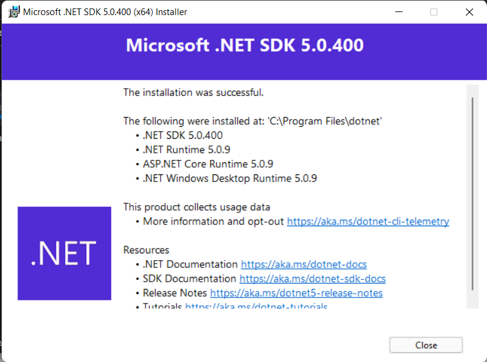

## Memastikan .NET Core SDK Telah Terinstall

### Cek PATH

* Tekan pada keybord, tombol Windows+R (tombol windows adalah tombol yang mempunyai logo 'jendela', biasanya disamping tombol alt, tekan tombol windows, lalu sambil menekannya, tekan tombol R)
* Akan muncul tampilan seperti ini:

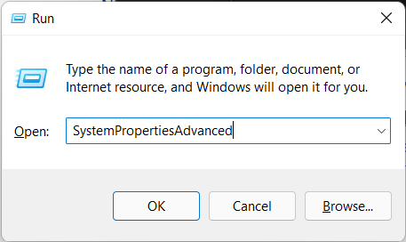

* Ketikkan 'SystemPropertiesAdvanced' lalu tekan Enter
* Saat muncul tampilan berikut, tekan tombol 'Environment Variables'

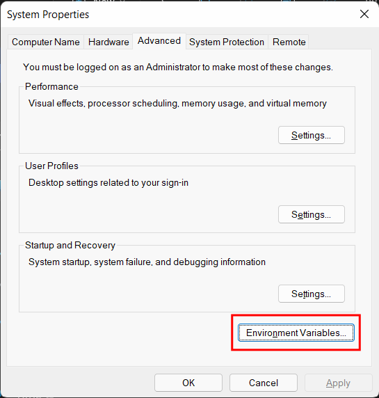

* Pada tampilan berikutnya, cari 'Path' di bagian 'System Variables' lalu tekan tombol edit

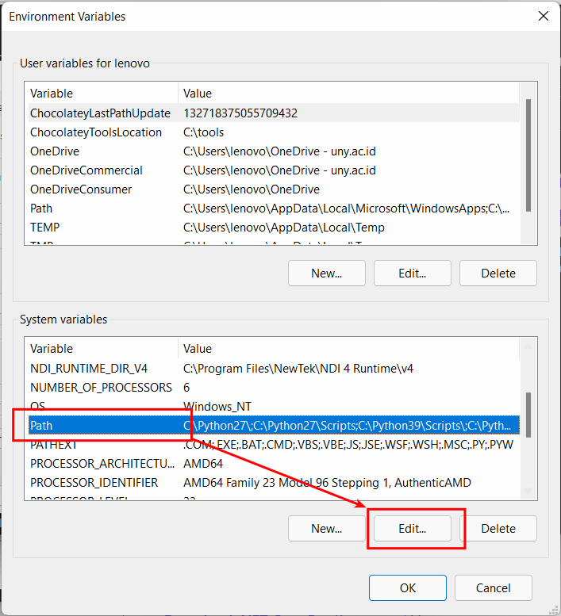

* Setelah itu cari lagi nilai `C:\Program Files\dotnet`

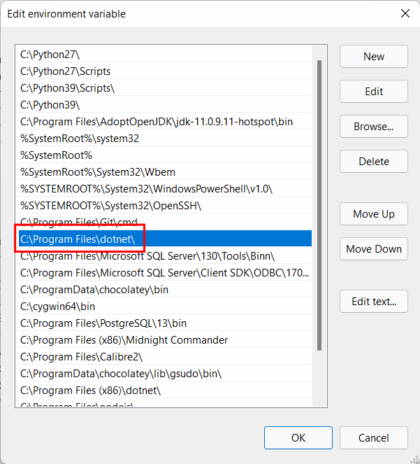

* Jika **tidak ada**, buat nilai baru dan masukkan `C:\Program Files\dotnet`

* Lalu tekan OK &rarr; OK &rarr; OK

### Menjalankan Dotnet CLI

* Buka 'Run' dengan menekan tombol Windows+R di keyboard
* Ketikkan `powershell` lalu tekan Enter
* Pada jendela powershell, ketikkan `dotnet --info` lalu Enter lagi, setelah itu cari pada bagian '.NET SDK Installed', jika sudah ada maka maka instalasi berhasil

## Membuat Proyek Menggunakan Dotnet CLI

* Buat folder yang digunakan untuk menyimpan proyek, misal `D:\projects`
* Buka powershell, seperti sebelumnya
* Masuk ke folder proyek menggunakan perintah `cd`, misal `cd D:\Projects` lalu tekan Enter
* Buat folder dengan nama proyek menggunakan perintah `mkdir`, misal jika ingin membuat folder bernama `ProyekBaru` berarti perintahnya: `mkdir ProyekBaru`, lalu tekan enter
* Masuk ke folder yang baru saja dibuat menggunakan `cd` lagi. Jika nama foldernya adalah `ProyekBaru` berarti perintahnya adalah `cd ProyekBaru`
* Setelah berada pada folder tujuan, ketikkan `dotnet new console`
* Setelah perintah selesai dijalankan, ketikkan `code .` di powershell lalu Enter

## Menginstall Ekstensi C# pada VS Code

* Buka menu ekstensi, search 'C#' lalu install ekstensinya, seperti dibawah ini

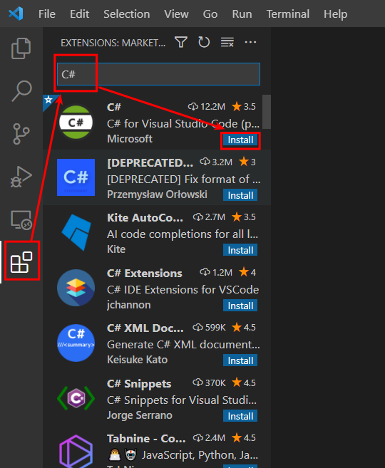

* Tunggu sampai proses instalasi selesai dan restart VS Code jika diminta

## Membuka File Program.cs

* Buka menu 'explorer' di bagian kiri, lalu klik dua kali file 'Program.cs'

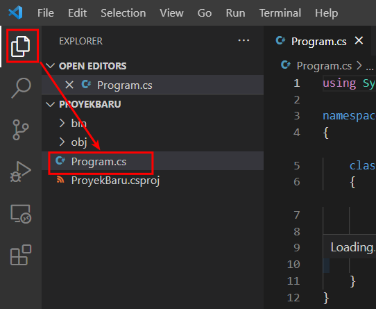

* File akan ditampilkan dan kalian bisa mengeditnya

## Menjalankan Program dengan Dotnet CLI

* Buka powershell baru, atau gunakan yang sebelumnya
* Masuk ke folder proyek, jika sama seperti saya tadi berarti `D:\projects\ProyekBaru`, maka perintahnya adalah `cd D:\projects\ProyekBaru`
* Setelah sudah berada dalam folder, ketikkan perintah `dotnet run` untuk menjalankan program kita

## Menggunakan Terminal Dalam VS Code

* Tekan tombol Ctrl+\` pada keyboard (symbol \` (backtick) biasanya ada di atas tombol 'Tab')
* Jika berhasil maka akan muncul tampilan dibawah tampilan kode, seperti ini:

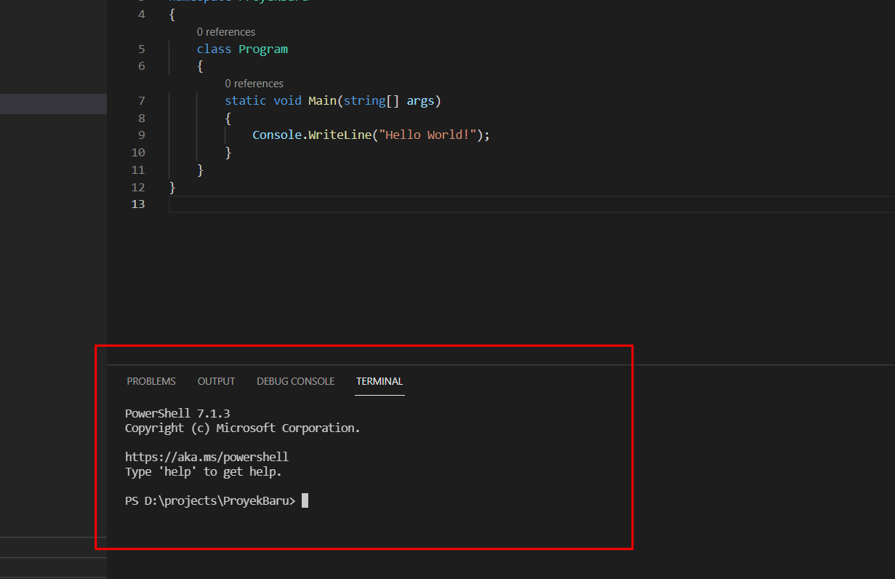

* Dalam terminal tersebut kalian sudah berada pada folder proyek, jadi jika kalian jalankan perintah `dotnet run` maka program akan dijalankan
* Cobalah sendiri, ketikkan `dotnet run` dalam terminal tersebut lalu tekan Enter
